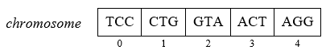

# Genetic Algorithm for the Sequencing by Hybridization Problem

This repository contains a Python implementation of the Genetic Algorithm metaheuristic for the sequencing by hybridization problem. 

Sequencing by hybridization (SBH) is a technique used to determine the order in which nucleotides occur in a strand of DNA. In SBH, short synthetic oligonucleotides are designed and synthesized to hybridize with complementary segments of the target sequence. By observing the hybridization patterns, the sequence of the target molecule can be inferred.

## Problem

Data are a classical DNA spectrum as a set *S_classical*, the length of the original DNA *n*, the length of the oligonucleotides used *l=k* (for *k>=7*), and the percentage of positive and negative errors (potentially of both types). The solution to the problem is a DNA sequence with a minimum distance from the original sequence.

## Description

The genetic representation of an individual is a chromosome, which is a vector composed of all the oligonucleotides contained in a spectrum *S*. Each oligonucleotide in the chromosome has an assigned position in the vector, and the chromosome itself is a permutation of all the oligonucleotides of the spectrum. In this permutation, successive indices correspond to successive elements of the ordered solution.

Representation of an individual for an example spectrum `S = {ACT, AGG, CTG, GTA, TCC}`

### How the algorithm works:
- **Initialization:** The program generates an initial population of sequences using random strategy or a semi-deterministic greedy approach.

- **Evaluation:** Fitness evaluation of each individual is the maximum number of oligonucleotides that, overlapping in the sequence appropriate to the chromosome, form a nucleotide sequence of length not greater than *n*, with maximum overlap. The fitness value is normalized based on the maximum number of oligonucleotides in the correct resulting sequence and scaled linearly.

- **Selection:** Roulette wheel selection is employed to choose individuals from the population for the next generation.

- **Crossover:** Crossover is performed using a greedy crossover method, enhancing the diversity of the population.

- **Mutation:** Mutation involves swapping two random oligonucleotides within a sequence.

## Usage
The program can be customized through parameters such as:

* oligonucleotide length
* population size
* maximum number of generation 
* crossover and mutation probability
* substitution rate
* percentage of positive and negative errors introduced

## Acknowledgements

Algorithm implemented as a student project in the course "Combinatorial Optimization".
